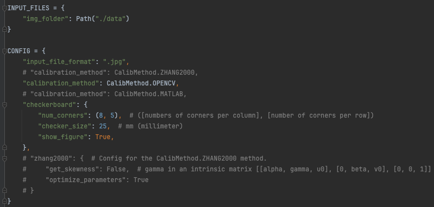
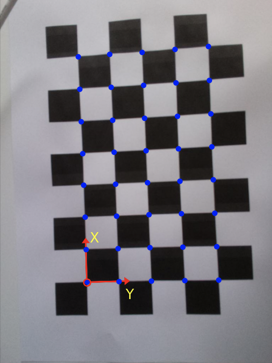
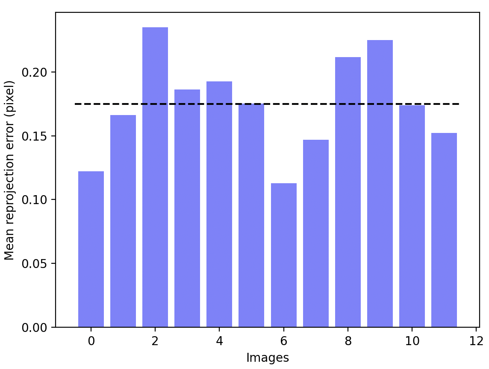

# About this Repository
This repository provides a Python script for getting camera intrinsics and extrinsics parameters using patterned images.

# 使用说明

依赖numpy, opencv

### 收集图片用于标定内参：
可用提供的`collect_images.py`采集或自行用相机多角度拍标定板，理论最少需要三张，实际可用10～20张提高准确度。

`python scripts/collect_images.py 2 4 5` 默认3Hz采集图片写入`data/{camera_id}/`，需手动挑选一下照片

### 标定内参：
用`data/{camera_id}/`中图片标定内参

`python scripts/export_intrinsics.py {camera_ids}`

`--num-corners` 标定板内角数，m x n 格子就是 (m-1) x (n-1)内角

`--square-size` in mm

`--output-root` 输出路径默认`intrinsics/{camera_id}/calibration.txt`

### 标定外参

内参标定后把文件夹名由id改为相机名，在`scripts/solve_extrinsics.py`起始处dict填对应id和相机名,标定外参，默认存在`extrinsics/`下，如果尚没有`scripts/{camera_name}`文件夹会创建一个并保存一个`extrinsics/standard/standard_pose.json`作为标准位置，之后对比标准位置计算需要做的相机位置变换。

# Available Methods
#### OpenCV-based method (reference)
OpenCV functions are used to detect checkerboard corners and get camera intrinsics and extrinsics parameters. The procedure is explained in [[1](https://docs.opencv.org/4.x/dc/dbb/tutorial_py_calibration.html)]. 
#### MATLAB-based method (reference)
The MATLAB function, `./algorithm/matlab/calib_with_matlab.m`, is called from a python script and used to do the checkerboard detection and camera calibration. See [[2](https://mathworks.com/help/vision/ref/estimatecameraparameters.html)].
#### Zhang's method
This is a Python implementation built from scratch based on the original paper of Zhang [[3](https://ieeexplore.ieee.org/document/888718)]. Intrinsics and extrinsics parameters are determined as closed form solutions of equations. As an option, it is possible to optimize the determined camera parameters by minimizing reprojection error.

# How to Use
The `main.py` code is very simple as shown below:
   
Once you specify the `CONFIG` dictionary, you can simply run this code to calibrate a camera. Please note that all input images should contain a checkerboard with good visibility and be stored in the `./data` folder.  

# What Can this Tool Do?
### 1. Camera Calibration
By using this tool, intrinsics and extrinsics parameters of a camera can be obtained. The extrinsics parameters can be determined for each image.    
    
Example data, which are images of a printed checkerboard pattern generated from [[4](https://calib.io/pages/camera-calibration-pattern-generator)], are provided in the `./data` folder. 

### 2. Clarifying the Coordinate System
In order to interpret the extrinsic parameters better, X and Y axes with a coordinate origin can be visualized together with detected checkerboard corners.  
    

### 3. Reprojection Error Evaluation
In addition, reprojection error can be also calculated in order to quantitatively assess the quality of the determined camera calibration parameters.  
  

# Technical Background
See also [[3](https://ieeexplore.ieee.org/document/888718)] and [[5](https://mathworks.com/help/vision/ug/camera-calibration.html)].
# References 
[[1](https://docs.opencv.org/4.x/dc/dbb/tutorial_py_calibration.html)] OpenCV, *Camera Calibration*, opencv.org [Online]. Available: https://docs.opencv.org/4.x/dc/dbb/tutorial_py_calibration.html [Accessed: 01 January, 2024]  
[[2](https://mathworks.com/help/vision/ref/estimatecameraparameters.html)] MathWorks, *estimateCameraParameters*, mathworks.com [Online]. Available: https://mathworks.com/help/vision/ref/estimatecameraparameters.html [Accessed: 01 Januarry, 2024]  
[[3](https://ieeexplore.ieee.org/document/888718)] Z. Zhang, “A Flexible New Technique for Camera Calibration.” IEEE Transactions on Pattern Analysis and Machine Intelligence. vol. 22, no. 11, pp. 1330–1334, 2000.  
[[4](https://calib.io/pages/camera-calibration-pattern-generator)] calib.io, *Pattern Generator*, calib.io [Online]. Available: https://calib.io/pages/camera-calibration-pattern-generator [Accessed: 02 January, 2024]  
[[5](https://mathworks.com/help/vision/ug/camera-calibration.html)] MathWorks, *What Is Camera Calibration*, mathworks.com [Online]. Available: https://mathworks.com/help/vision/ug/camera-calibration.html [Accessed: 02 January, 2024]  
